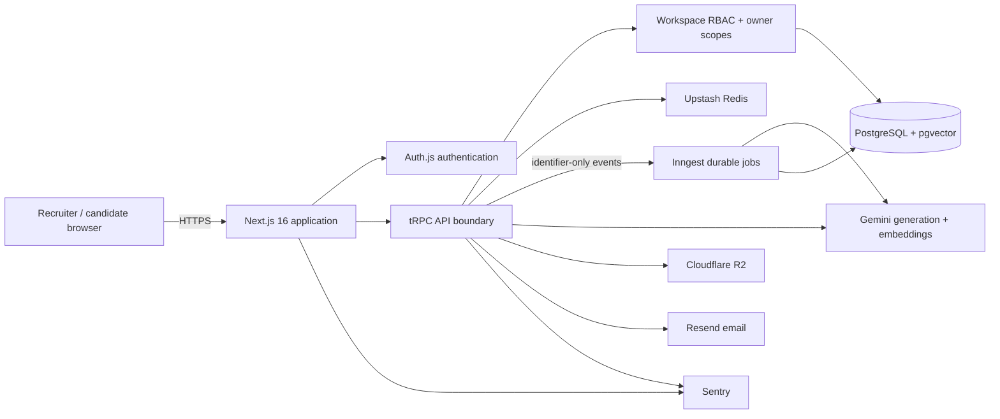
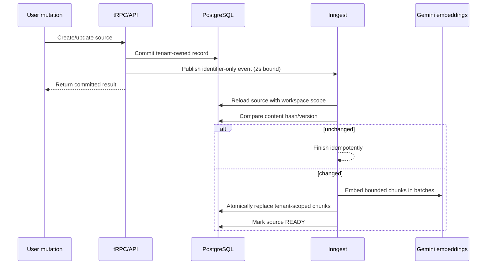

# CareerPilot AI architecture

## System context

## Request path

1. Auth.js establishes the user identity.
2. `workspaceProcedure` derives `workspaceId` from validated input and verifies membership.
3. Role gates protect privileged operations. Owner scopes restrict seeker-visible records.
4. Queries include both workspace and owner constraints before IDs are dereferenced.
5. Expensive endpoints apply Upstash-backed rate limits in production.
6. Mutations write audit events without returning private database fields to clients.

The browser never receives database, AI-provider, R2, Inngest, email, or Sentry secrets.

## Background indexing path

Index jobs retry four times, serialize work per source, mark exhausted indexing failures, and skip unchanged content. A workspace backfill is the recovery path for event-delivery outages or model-version changes.

## Data and trust boundaries

| Boundary | Control |
|---|---|
| Browser → Next.js | Zod validation, authenticated sessions, CSRF protections from Auth.js/Next.js |
| User → workspace | Membership lookup on every workspace procedure |
| Seeker → peer record | `ownerId` scoping and not-found responses |
| API → AI | Bounded inputs, validated structured output, rate limits |
| API → R2 | Server-owned keys, signature validation, size/type limits, signed downloads |
| API → background jobs | Identifier-only events; source is reloaded under tenant scope |
| Service → PostgreSQL | TLS production connection; guarded local migration commands |
| Runtime → operators | Sentry errors/traces and `/api/health` readiness without secrets |

## Deployment topology

The reference production topology is Vercel for the Node.js runtime, Neon PostgreSQL with pgvector, Cloudflare R2, Upstash Redis, Inngest, Gemini, Resend, and Sentry. The application also supports a standard Node.js deployment through `npm run build` and `npm start`.

## Decisions

- [ADR 0001: application-enforced tenant isolation](adr/0001-application-tenant-isolation.md)
- [ADR 0002: durable and idempotent RAG indexing](adr/0002-durable-rag-indexing.md)
- [ADR 0003: managed production topology](adr/0003-managed-production-topology.md)
