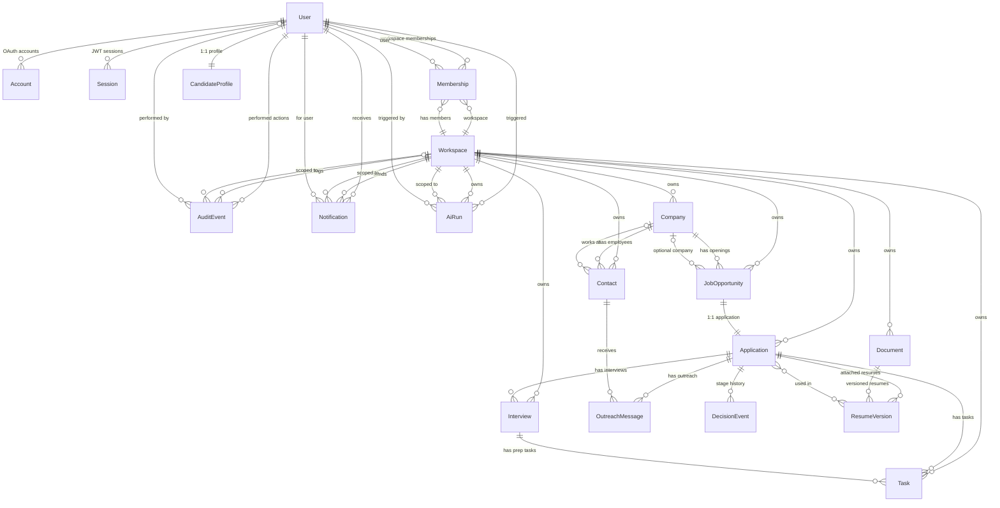
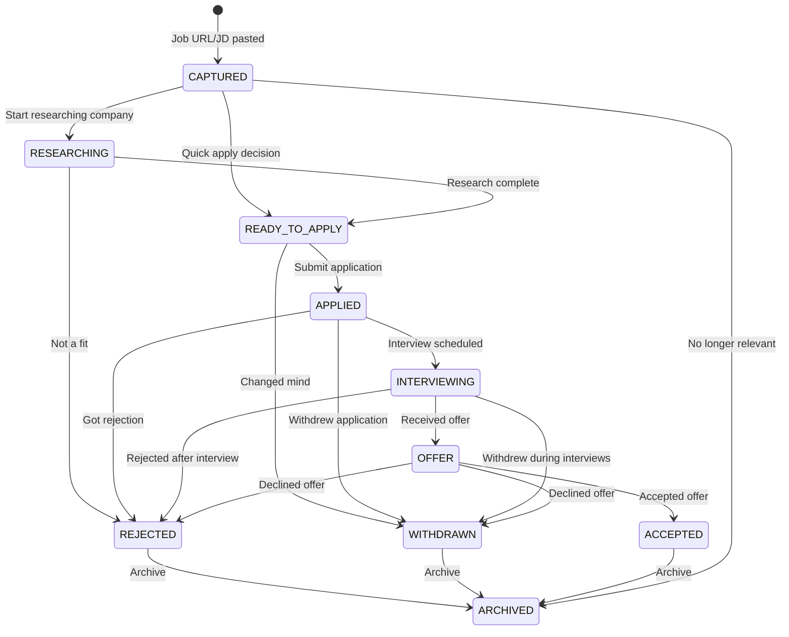

# CareerPilot AI — Complete Project Overview

## What is CareerPilot AI?

CareerPilot AI is a **multi-tenant, AI-powered job search and career networking platform**. It helps job seekers capture job opportunities, track applications through a structured pipeline, manage recruiter contacts, prepare for interviews, and get AI-powered fit scoring and suggestions — all inside private workspaces.

### Who is it for?

- **Job Seekers** — individuals managing their job search pipeline
- **Career Coaches** — professionals managing multiple candidates' searches
- **Small Teams** — a coach + candidate pair working together in a shared workspace

### Core Problem It Solves

Job searching is chaotic: you find jobs on LinkedIn, company sites, referrals, and cold emails — then lose track of where you applied, who you talked to, what follow-ups are pending, and whether a role is actually a good fit. CareerPilot AI centralizes all of this with:

1. **Quick Capture** — paste a URL or JD, AI extracts structured data
2. **Pipeline Tracking** — 10-stage application workflow with decision history
3. **AI Fit Scoring** — explainable 0-100 score with missing skills highlighted
4. **Contact Management** — track recruiters, interviewers, and networking contacts
5. **Interview Prep** — AI-generated interview questions based on the JD
6. **Document Vault** — versioned resumes, cover letters, and offer letters
7. **Smart Notifications** — stale application alerts, upcoming interviews, task reminders
8. **RAG Assistant** — grounded chat over your own documents and application history

---

## Tech Stack

| Layer | Technology | Why |
|---|---|---|
| **Frontend** | Next.js (App Router), TypeScript, Tailwind CSS | SSR + client components, file-based routing, type safety |
| **API** | tRPC + Zod | End-to-end type safety, no codegen step, input validation |
| **Database** | PostgreSQL + Prisma ORM | Relational integrity, migrations, type-safe queries |
| **Auth** | Auth.js v5 (NextAuth) | Credentials + Google OAuth, JWT sessions, middleware protection |
| **AI** | Vercel AI SDK + Google Gemini | Structured outputs, streaming, multimodal (PDF parsing) |
| **Vector Search** | pgvector | RAG over documents, semantic similarity for job matching |
| **Background Jobs** | Inngest | Reliable async processing for AI runs, notifications, reminders |
| **File Storage** | Cloudflare R2 | S3-compatible, zero egress fees, stores resumes & documents |
| **Testing** | Vitest + Playwright | Unit/integration + E2E browser automation |
| **CI/CD** | GitHub Actions → Vercel | Lint + typecheck + build on every PR, auto-deploy on merge |
| **Monitoring** | Sentry | Error tracking, performance monitoring |
| **Database Hosting** | Neon | Serverless Postgres with branching, instant scale-to-zero |

---

## Architecture Overview

```
┌─────────────────────────────────────────────────────────────┐
│                        Client (Browser)                      │
│  Next.js App Router · Tailwind · tRPC React Provider         │
│  TanStack Query (caching) · Auth.js (JWT in cookie)          │
└───────────────┬──────────────────────────────┬──────────────┘
                │                              │
     ┌──────────▼──────────┐         ┌────────▼─────────┐
     │   Next.js Server     │         │   Auth.js v5     │
     │   (Node.js Runtime)  │         │   JWT Sessions   │
     │                       │         │   Credentials +  │
     │  ┌─────────────────┐ │         │   Google OAuth   │
     │  │  tRPC Server    │ │         └────────┬─────────┘
     │  │  Routers:       │ │                  │
     │  │  - workspace    │ │                  │
     │  │  - application  │ │                  │
     │  │  - contact      │ │                  │
     │  │  - interview    │ │                  │
     │  │  - ai           │ │                  │
     │  │  - document     │ │                  │
     │  └────────┬────────┘ │                  │
     │           │          │                  │
     │  ┌────────▼────────┐ │                  │
     │  │  Prisma Client  │◄┼──────────────────┘
     │  └────────┬────────┘ │
     └───────────┼──────────┘
                 │
     ┌───────────▼──────────┐    ┌───────────────────┐
     │   PostgreSQL          │    │   Cloudflare R2    │
     │   (Neon / Docker)     │    │   (File Storage)   │
     │   + pgvector ext      │    └───────────────────┘
     └───────────────────────┘
                 │
     ┌───────────▼──────────┐    ┌───────────────────┐
     │   Inngest             │    │   Google Gemini    │
     │   (Background Jobs)   │    │   (AI Model)       │
     │   - AI extraction     │    │   - Structured OP  │
     │   - Fit scoring       │    │   - Embeddings     │
     │   - Notifications     │    │   - Chat           │
     │   - Staleness checks  │    └───────────────────┘
     └───────────────────────┘
```

### Multi-Tenancy Model

```
User ──┬── Membership ──── Workspace (tenant boundary)
       │      (role)            │
       │                   ┌────┴────┬──────┬──────────┐
       │                 Company  Contact  Application  Task
       │                   │                    │
       │              JobOpportunity       Interview
       │                                      │
       └── CandidateProfile              DecisionEvent
```

Every domain record (Company, JobOpportunity, Application, Contact, Interview, Task, Document, AiRun, Notification) carries a `workspaceId`. The tRPC `workspaceProcedure` middleware verifies that the authenticated user has an active `Membership` in that workspace before allowing any access.

### RBAC Roles

| Role | Permissions |
|---|---|
| **OWNER** | Full control: create/delete workspace, invite members, remove members, all CRUD |
| **COACH** | View and manage all data in workspace, manage applications, add contacts, trigger AI |
| **SEEKER** | Manage own applications, add contacts, trigger AI on own data |

---

## ERD Diagram



### Entity Details

#### Auth Entities (Auth.js managed)
- **User** — email, passwordHash (credentials), name, image, emailVerified
- **Account** — OAuth provider accounts (Google), linked to User
- **Session** — JWT session tokens (if using database sessions; currently using JWT strategy)
- **VerificationToken** — email verification tokens

#### Tenancy Entities
- **Workspace** — the tenant boundary; has name, slug (unique)
- **Membership** — join table: User ↔ Workspace with a Role (OWNER/COACH/SEEKER)
- **CandidateProfile** — 1:1 with User; headline, skills, experience, desired roles, salary

#### Job Pipeline Entities
- **Company** — name, website, industry, notes; scoped to Workspace
- **JobOpportunity** — title, rawInput (original capture), sourceUrl, location, employmentType, requiredSkills[], preferredSkills[], salaryRange, deadline; optional Company link; 1:1 with Application
- **Application** — the core pipeline entity; stage (10-state enum), fitScore (0-100), fitReasons (JSON), missingSkills[], appliedAt, lastStageAt (staleness detection)
- **DecisionEvent** — audit trail of stage transitions (fromStage → toStage + note)

#### Networking Entities
- **Contact** — name, role, email, linkedinUrl, relationship, lastInteraction, nextAction; optional Company link
- **OutreachMessage** — subject, body, approved (boolean), sentAt; linked to Contact + optional Application

#### Interview & Task Entities
- **Interview** — type (PHONE_SCREEN/TECHNICAL/SYSTEM_DESIGN/BEHAVIORAL/HR/ONSITE/OTHER), scheduledAt, durationMins, interviewer, outcome (PENDING/PASSED/FAILED/NO_SHOW/CANCELLED)
- **Task** — title, description, status (OPEN/IN_PROGRESS/DONE/CANCELLED), dueAt; linked to Application and/or Interview

#### Document Entities
- **Document** — type (RESUME/COVER_LETTER/CERTIFICATE/PORTFOLIO/OFFER_LETTER/OTHER), fileName, storageKey (R2), mimeType, sizeBytes
- **ResumeVersion** — version number, label; linked to Document; many-to-many with Application

#### AI & Observability Entities
- **AiRun** — type (JOB_EXTRACTION/FIT_SCORING/OUTREACH_DRAFT/INTERVIEW_QUESTIONS/FOLLOW_UP_DRAFT/RESUME_SUGGESTION/ASSISTANT_CHAT), status (PENDING/RUNNING/SUCCEEDED/FAILED), model, output (JSON), latencyMs
- **AuditEvent** — action, entityType, entityId, metadata (JSON); fire-and-forget logging
- **Notification** — type (TASK_DUE/DEADLINE_APPROACHING/INTERVIEW_UPCOMING/APPLICATION_STALE/SYSTEM), title, body, readAt

---

## Application Pipeline (State Machine)



Every transition creates a **DecisionEvent** record with `fromStage`, `toStage`, and an optional note — giving a full audit trail of the application journey.

---

## AI Features

| Feature | AI Run Type | Input | Output |
|---|---|---|---|
| **Job Extraction** | `JOB_EXTRACTION` | Raw URL or pasted JD text | Structured: title, company, location, skills, salary, deadline |
| **Fit Scoring** | `FIT_SCORING` | JD + CandidateProfile | 0-100 score, matching skills, missing skills, reasons (JSON) |
| **Outreach Draft** | `OUTREACH_DRAFT` | Contact + Application context | Drafted cold email / LinkedIn message |
| **Interview Questions** | `INTERVIEW_QUESTIONS` | JD + Application context | List of likely technical + behavioral questions |
| **Follow-up Draft** | `FOLLOW_UP_DRAFT` | Application stage + time since last contact | Polite follow-up email draft |
| **Resume Suggestion** | `RESUME_SUGGESTION` | JD + ResumeVersion | Tailored bullet point suggestions |
| **RAG Assistant** | `ASSISTANT_CHAT` | User question + vector search over documents | Grounded answer with citations |

All AI runs are logged in the `AiRun` table with status, latency, model used, and full output — enabling cost tracking and debugging.

---

## 8-Week Roadmap

| Week | Theme | Key Deliverables |
|---|---|---|
| **Week 1** | Foundation | Next.js scaffold, Prisma schema, tRPC + RBAC, Auth.js, Docker, CI, seed |
| **Week 2** | Pipeline + Quick Capture | Application CRUD, Kanban board UI, Quick Capture modal, stage transitions |
| **Week 3** | AI Extraction & Fit Scoring | Gemini integration, job extraction from URL/JD, fit score with explainable breakdown |
| **Week 4** | Contacts & Networking | Contact CRUD, outreach message drafting, LinkedIn import, contact timeline |
| **Week 5** | Interviews & Tasks | Interview scheduling, prep question generation, task management, calendar view |
| **Week 6** | Document Vault | R2 upload/download, resume versioning, resume tailoring suggestions, PDF parsing |
| **Week 7** | RAG Assistant | pgvector setup, document embeddings, grounded chat with citations, chat history |
| **Week 8** | Testing & Launch | Vitest unit tests, Playwright E2E, Sentry, Vercel + Neon deploy, demo prep |

---

## PRD (Product Requirements Document)

### 1. Vision

Build an AI-powered job search platform that replaces the scattered spreadsheet + bookmark + email approach with a single, intelligent workspace that tracks every job opportunity from discovery to offer.

### 2. Goals

- **G1**: Reduce time-to-apply by 50% through AI-powered job extraction and quick capture
- **G2**: Provide explainable fit scoring so candidates focus on high-probability roles
- **G3**: Never lose track of a contact, follow-up, or interview again
- **G4**: Enable coach-seeker collaboration in shared workspaces
- **G5**: Ground AI suggestions in the user's own documents (RAG) to avoid generic advice

### 3. Non-Goals (v1)

- Not a job board — we don't list jobs, we track jobs the user finds
- Not a resume builder — we suggest edits, not generate from scratch
- Not an ATS for employers — this is candidate-side only
- No mobile app — responsive web only for v1

### 4. User Personas

#### Persona 1: Karthik (Job Seeker)
- Final-year CS student, applying to 20-30 companies
- Finds jobs on LinkedIn, company sites, referrals
- Needs: track where he applied, who he talked to, what follow-ups are pending
- Pain: loses track of applications in spreadsheets, forgets follow-ups

#### Persona 2: Sarah (Career Coach)
- Manages 5-10 candidates at a time
- Needs: visibility into each candidate's pipeline, ability to review and suggest
- Pain: no centralized view, context switching between candidates

### 5. Functional Requirements

#### 5.1 Authentication & Onboarding
- **FR-1.1**: Users can register with email/password or Google OAuth
- **FR-1.2**: First-time users get a default personal workspace created automatically
- **FR-1.3**: Users can create additional workspaces and invite members
- **FR-1.4**: Workspace owner can assign roles (OWNER/COACH/SEEKER) to members

#### 5.2 Quick Capture
- **FR-2.1**: User pastes a job URL or raw JD text into Quick Capture
- **FR-2.2**: AI extracts: title, company, location, employment type, required skills, preferred skills, salary range, deadline
- **FR-2.3**: Extracted data creates a JobOpportunity + Application (stage: CAPTURED)
- **FR-2.4**: Original raw input is always preserved in `rawInput` field

#### 5.3 Application Pipeline
- **FR-3.1**: Kanban board view with 10 columns (one per stage)
- **FR-3.2**: Drag-and-drop to change application stage
- **FR-3.3**: Every stage change creates a DecisionEvent with timestamp
- **FR-3.4**: Application detail view shows: fit score, missing skills, interviews, tasks, contacts, outreach, decision history
- **FR-3.5**: Stale application detection (no stage change in X days → notification)

#### 5.4 AI Fit Scoring
- **FR-4.1**: System compares JD required skills against CandidateProfile skills
- **FR-4.2**: Outputs 0-100 fit score with breakdown: matching skills, missing skills, experience gap
- **FR-4.3**: Score is explainable — user can see why each point was awarded/deducted
- **FR-4.4**: Score stored in `fitScore` + `fitReasons` (JSON) on Application

#### 5.5 Contact Management
- **FR-5.1**: Add contacts manually with name, role, email, LinkedIn URL
- **FR-5.2**: Link contacts to companies and/or applications
- **FR-5.3**: AI drafts outreach messages (cold email, follow-up) based on context
- **FR-5.4**: Track outreach message approval status and send date
- **FR-5.5**: Contact timeline showing all interactions

#### 5.6 Interview Management
- **FR-6.1**: Schedule interviews with type, date/time, duration, interviewer name
- **FR-6.2**: AI generates likely interview questions based on JD
- **FR-6.3**: Track interview outcome (PENDING/PASSED/FAILED/NO_SHOW/CANCELLED)
- **FR-6.4**: Create prep tasks linked to interviews

#### 5.7 Task Management
- **FR-7.1**: Create tasks with title, description, due date, status
- **FR-7.2**: Tasks can be linked to applications and/or interviews
- **FR-7.3**: Task notifications for due dates approaching
- **FR-7.4**: Task list view filtered by status, due date, workspace

#### 5.8 Document Vault
- **FR-8.1**: Upload documents (resume, cover letter, certificates, offer letters) to R2
- **FR-8.2**: Resume versioning — each upload creates a new version
- **FR-8.3**: Attach specific resume versions to applications
- **FR-8.4**: AI suggests resume tailoring based on JD (bullet point rewrites)
- **FR-8.5**: Documents are workspace-scoped and access-controlled

#### 5.9 RAG Assistant
- **FR-9.1**: Documents are embedded and stored in pgvector
- **FR-9.2**: Chat interface with streaming responses
- **FR-9.3**: Answers are grounded in user's documents with citations
- **FR-9.4**: Chat history is saved per workspace
- **FR-9.5**: Assistant can answer: "What did the recruiter say last week?", "Which resume version did I send to Google?"

#### 5.10 Notifications
- **FR-10.1**: In-app notification center
- **FR-10.2**: Notification types: task due, deadline approaching, interview upcoming, application stale, system
- **FR-10.3**: Background job (Inngest) checks for stale applications and upcoming deadlines
- **FR-10.4**: Mark notifications as read

### 6. Non-Functional Requirements

- **NFR-1 (Security)**: All data is workspace-scoped; no cross-tenant access. Postgres RLS as defense-in-depth.
- **NFR-2 (Performance)**: Page load < 2s. AI operations show loading states; long-running jobs run async via Inngest.
- **NFR-3 (Reliability)**: AI failures are graceful — user sees error, can retry. AiRun records all attempts.
- **NFR-4 (Scalability)**: Serverless deployment (Vercel + Neon). Scale-to-zero for dev, autoscale for prod.
- **NFR-5 (Observability)**: Sentry for error tracking. AuditEvent for all significant mutations. AiRun for AI cost/latency tracking.
- **NFR-6 (Type Safety)**: End-to-end TypeScript: Zod schemas → tRPC procedures → React components. No any types.
- **NFR-7 (Testing)**: Unit tests for business logic (Vitest). E2E for critical flows (Playwright). CI gates on every PR.

### 7. Technical Constraints

- **TC-1**: Must work on free tiers for all services (Vercel, Neon, R2, Inngest, Gemini)
- **TC-2**: Must be deployable with a single `git push` (Vercel auto-deploy)
- **TC-3**: Local dev must work with Docker Compose only (no cloud dependencies for dev)
- **TC-4**: No proprietary APIs — all integrations must have open-source alternatives available

### 8. Success Metrics

- **SM-1**: Demo flow works end-to-end: register → capture job → AI extraction → fit score → apply → track → interview → offer
- **SM-2**: All CI checks pass (lint + typecheck + build)
- **SM-3**: E2E tests cover: auth, quick capture, pipeline stage change, AI fit scoring
- **SM-4**: Project demonstrates: multi-tenancy, RBAC, AI integration, background jobs, file storage, vector search, real-time notifications

### 9. Risks & Mitigations

| Risk | Impact | Mitigation |
|---|---|---|
| Gemini API rate limits | AI features blocked | Implement retry + fallback to smaller model; cache results |
| R2 upload failures | Documents lost | Retry with exponential backoff; show upload progress |
| pgvector performance | Slow RAG queries | Index with IVFFlat; limit context window; pre-filter by workspace |
| Inngest cold starts | Delayed notifications | Acceptable for v1; document SLA expectations |
| Scope creep | Project incomplete | Strict 8-week timeline; cut features, not quality |
